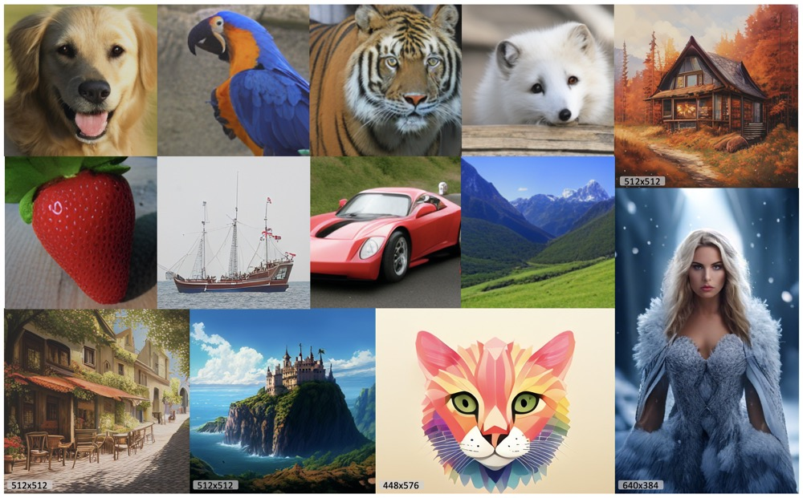

# Exploring the Design Space of Autoregressive Models for Efficient and Scalable Image Generation

## Repository Structure
Here's an overview of the repository structure:

      ├ MaskGIL/
      |    ├── Metrics/                               <- evaluation tool
      |    |      ├── inception_metrics.py                  
      |    |      └── sample_and_eval.py
      |    |    
      |    ├── Network/                             
      |    |      ├── Taming/                         <- VQGAN architecture   
      |    |      ├── tokenizer/                      <- VQGAN architecture  
      |    |      ├── gpt.py                          <- Bi-Direction LLaMA architecture      
      |    |      └── transformer.py                  <- Bi-Transformer architecture  
      |    |
      |    ├── Trainer/                               <- Main class for training
      |    |      ├── trainer.py                      <- Abstract trainer     
      |    |      └── vit.py                          <- Trainer of MaskGIL
      |    ├── images/                                <- Image samples         
      |    |
      |    ├── requirements.yaml                      <- help to install env 
      |    ├── FID_sample.py                          <- sample 50K images for FID
      |    └── main.py                                <- Main
      

## 🔥 Update
[2024.10.07] Code and c2i checkpoints are released!

## 🌿 Introduction
we delve into the design space of general AR models, including Mask Autoregressive (MAR) models, to identify optimal configurations for efficient and scalable image generation. We first conduct a detailed evaluation of four prevalent image tokenizers across both AR and MAR settings, examining the impact of codebook size (ranging from 1,024 to 262,144) on generation quality, and identify the most effective tokenizer for image generation. Building on these insights, we propose an enhanced MAR model architecture, named Masked Generative Image LLaMA (MaskGIL), comprising of LlamaGen-VQ and Bidirectional LLaMA. To ensure stable scaling, we introduce modifications like query-key normalization and postnormalization, resulting in a series of class-conditional MaskGIL models, ranging from 111M to 1.4B parameters. We also introduce a text-conditional MaskGIL model with 775M parameters, capable of flexibly generating images at any resolution. To bridge AR and MAR image generation, we explore their combination during inference time.

## 🦄 Class-conditional image generation on ImageNet

Method | params| tokens | FID (256x256) | weight 
--- |:---:|:---:|:---:|:---:|
MaskGIL-B   | 111M | 16x16 | 5.64 | [c2i_B_256.pt]()
MaskGIL-L   | 343M | 16x16 | 4.01 | [c2i_L_256.pt]()
MaskGIL-XL  | 775M | 16x16 | 3.90 | [c2i_X_256.pt]()
MaskGIL-XXL | 1.4B | 16x16 | 3.71 | [c2i_XXL_256.pt]()
