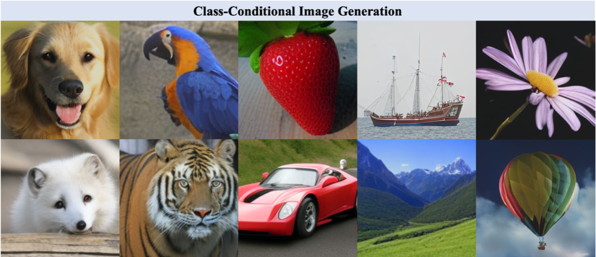
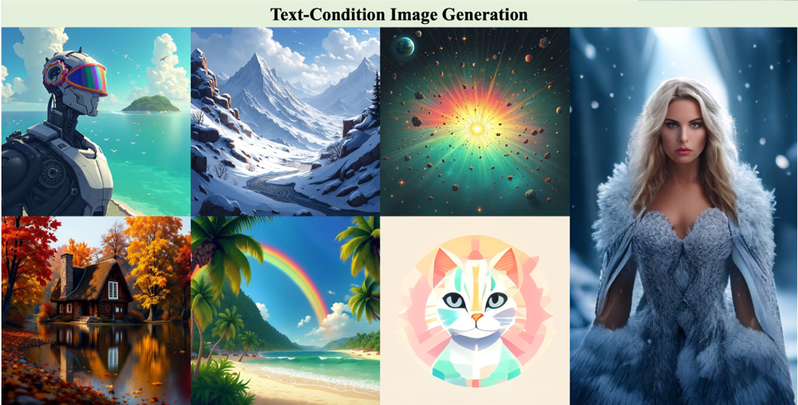
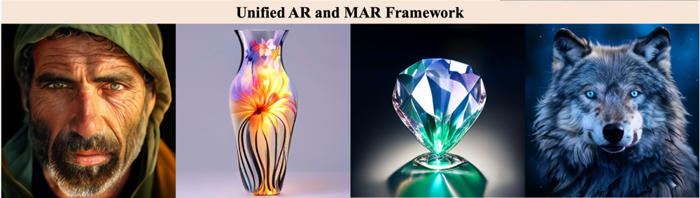

<div align="center">
<h1> Resurrect Mask AutoRegressive Modeling for Efficient and Scalable Image Generation </h1>
</div>

## 📚 Introduction
- In this work, we propose an enhanced mask autoregressive model architecture, **Masked Generative Image LLaMA (MaskGIL)**.
- Building upon this architecture, we introduce a series of class-driven and text-driven image generation models with parameter sizes ranging from 111M to 1.4B.
- Beyond its core image generation capabilities, we further extend MaskGIL to a broader range of applications, including: (1) **accelerating AR-based generation** and (2) **developing a real-time speech-to-image generation system**.

## 🔥 News
**[2025.7.17]** We released the technical report on [arXiv](https://arxiv.org/abs/2507.13032).
**[2025.4.10]** 🎉🎉🎉 Code and Class-driven checkpoints are released! 🎉🎉🎉


## 📽️ Demo Examples
<details open>
  <summary>Class-Driven Generation Results</summary>
  
</details>

<details open>
  <summary>Text-Driven Generation Results</summary>
  
</details>

<details open>
  <summary>Unified AR and MAR Generation Results</summary>
  
</details>


## 💻 Repository Structure
Here's an overview of the repository structure:

      ├ MaskGIL/
      |    ├── Metrics/                               <- evaluation tool
      |    |      ├── inception_metrics.py                  
      |    |      └── sample_and_eval.py
      |    |    
      |    ├── Network/                             
      |    |      ├── Taming/                         <- VQGAN architecture   
      |    |      ├── tokenizer/                      <- VQGAN architecture  
      |    |      ├── gpt.py                          <- Bi-Direction LLaMA architecture      
      |    |      └── transformer.py                  <- Bi-Transformer architecture  
      |    |
      |    ├── Trainer/                               <- Main class for training
      |    |      ├── trainer.py                      <- Abstract trainer     
      |    |      └── vit.py                          <- Trainer of MaskGIL
      |    ├── images/                                <- Image samples         
      |    |
      |    ├── requirements.yaml                      <- help to install env 
      |    ├── FID_sample.py                          <- sample 50K images for FID
      |    └── main.py                                <- Main

## 🚀 Quick Start
#### 1. Inference
```
python FID_sample.py
```

#### 2. Training
```
bash train.sh
```

## 🤗 Checkpoints

Method | params| tokens | FID (256x256) | weight 
--- |:---:|:---:|:---:|:---:|
MaskGIL-B   | 111M | 16x16 | 5.64 | [c2i_B_256.pt]()
MaskGIL-L   | 343M | 16x16 | 4.01 | [c2i_L_256.pt]()
MaskGIL-XL  | 775M | 16x16 | 3.90 | [c2i_X_256.pt]()
MaskGIL-XXL | 1.4B | 16x16 | 3.71 | [c2i_XXL_256.pt]()


## 📖 BibTeX

```
@misc{maskgil,
      title={Resurrect Mask AutoRegressive Modeling for Efficient and Scalable Image Generation},
      author={Yi Xin, Le Zhuo, Dongyang Liu, Qi Qin, Siqi Luo, Victor Shea-Jay Huang, Chang Xu, Hongsheng Li, Guangtao Zhai, Xiaohong Liu and Peng Gao},
      year={2025},
      url={https://github.com/synbol/MaskGIL},
}
```
